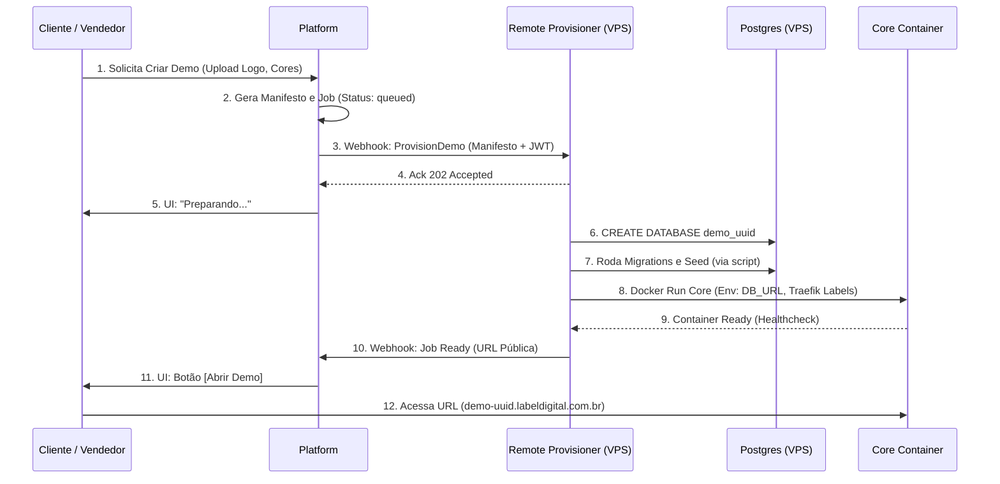

# Remote Demo Provisioning Design

## 1. Estado Atual
Atualmente, o provisionamento na Platform opera utilizando um provider simulado (`mock`). O fluxo se resume a gerar o manifesto na Platform, criar um `demo_provisioning_job`, passar pelos estados de `queued` até `ready` de maneira fictícia e exibir um botão "Abrir Demo". No lado do Core, o sistema apenas recebe um manifesto, valida-o e levanta a aplicação em modo de desenvolvimento local com os dados mockados, gerando um JSON de output de `readiness`. Não existe uma conexão real entre a Platform e a infraestrutura na nuvem para demonstrações comerciais.

## 2. Requisitos
- **Velocidade:** Provisionar uma aplicação funcional em poucos minutos para uso em demonstrações comerciais e vendas (presenciais e remotas).
- **Isolamento de Segurança:** A infraestrutura e os dados das demos não podem ter nenhuma relação com o ambiente de produção da La'Bel (Vercel, Supabase, Storages ou secrets).
- **Independência Multitenant:** Como o Core não foi desenhado como um SaaS multitenant compartilhado em nível de aplicação, cada demo precisa operar em ambiente logicamente isolado, respeitando a arquitetura existente.
- **Custo e Escalabilidade:** Evitar custos per-demo exorbitantes e as limitações severas de APIs de provedores focados em produção (como limites de projetos na Vercel ou Supabase).
- **Ciclo de Vida Temporário:** Demos devem ter um TTL (Time-To-Live) bem definido (ex: 24h, 72h) com mecanismo automático e seguro de destruição (cleanup) para evitar custos surpresa e desperdício.

## 3. Arquitetura Recomendada
A abordagem recomendada é utilizar **Containers Docker em uma VPS dedicada (ex: Hetzner, DigitalOcean)**, rodando um agente **RemoteDemoProvisioner**, acompanhado de um roteador proxy reverso dinâmico (**Traefik**) e uma única instância robusta de servidor **PostgreSQL** para hospedar os bancos de dados lógicos das demos. 

- **Provisionador:** Um serviço leve (Node.js/Go) que roda na VPS, escuta webhooks da Platform, interage com o Docker Daemon para subir instâncias do Core e executa queries de criação de banco (`CREATE DATABASE demo_xyz`) na instância central do Postgres da VPS.
- **Isolamento Lógico:** Cada cliente ganha seu container isolado rodando o Next.js e um banco lógico totalmente separado dentro da mesma instância de Postgres.
- **Subdomínios Automáticos:** O Traefik roteia tráfego automaticamente ao ler labels dos novos containers do Core (ex: `demo-abc.labeldigital.com.br`).

## 4. Diagrama do Fluxo

## 5. Responsabilidades Platform / Provisioner / Core

- **Platform (Orquestradora):** Central de negócios. Detém as regras do cliente, gerencia a intenção de criar demo, compila o manifesto final, gerencia billing, aciona o provisionamento e expõe a UI com o status para o usuário.
- **Remote Provisioner (Trabalhador):** Responsável estrito por interagir com infraestrutura bruta. Valida o payload da Platform, cria o banco, executa migrations, sobe o container, valida readiness, expõe pro Traefik e notifica a Platform, além de controlar a rotina de exclusão (cleanup) pós-vencimento.
- **Core (Aplicação Executável):** Responsável por rodar o software de cardápio e checkout na web consumindo suas credenciais isoladas (variáveis de ambiente providas no momento do `docker run`). O Core sequer sabe que é uma demo; ele apenas atende às requisições do seu banco isolado.

## 6. Comparação das Alternativas

| Critério | A) Vercel + Supabase Isolado | B) Vercel + DB Compartilhado (Multitenant) | C) Docker/VPS com Proxy (Recomendado) | D) Híbrido (Neon.tech + Vercel) |
| :--- | :--- | :--- | :--- | :--- |
| **Tempo de Provisionamento** | Lento (minutos para provisionar Supabase via API) | Muito rápido (apenas seeds) | **Rápido (Segundos para container/DB lógico)** | Rápido (API rápida, mas Vercel Deploy lento) |
| **Custo** | Alto (limite de instâncias/planos na Vercel/Supa) | Baixo | **Muito Baixo (~$20/mês fixa para N demos)** | Médio (custos elásticos por projeto Vercel) |
| **Isolamento** | Excelente | Ruim (Exige reescrever Core pra multitenant) | **Excelente (Container/DB isolados)** | Excelente |
| **Facilidade Automação** | Baixa (APIs restritas e complexas) | Média | **Alta (APIs abertas: Docker, bash, SQL)** | Alta |
| **Domínio/Subdomínio** | Fácil (Vercel API) | Fácil (Wildcard Domain) | **Fácil (Traefik automatizado)** | Fácil |
| **Teardown (Limpeza)** | Lento e propenso a resíduos (arquivos/limites de API) | Simples | **Instantâneo (rm container, drop database)** | Instantâneo no DB, complexo remover na Vercel |

## 7. Opção Recomendada para MVP
**Opção C (Docker em VPS + Traefik).** O Core atualmente não é multitenant. A VPS oferece o melhor balanço: permite "simular" ambientes de produção completamente isolados sem lidar com cotas punitivas de provedores de Nuvem (Vercel/Supabase). Subir um container Docker com um `DATABASE_URL` recém-criado em um cluster Postgres interno local leva segundos, oferecendo uma experiência incrível de "Uau" durante uma demonstração presencial, com custo essencialmente fixo.

## 8. Modelo de Segurança
- **Autenticação:** A comunicação da Platform com o Provisioner utilizará webhooks assinados com HMAC-SHA256 ou tokens JWT com secrets fortes. O Provisioner deve recusar qualquer requisição não autenticada.
- **Isolamento de Dados:** Cada demo possui seu banco (database lógico) com usuário único que só tem grant de acesso a ele. Injeções de SQL limitam-se ao banco da demo (impacto irrelevante).
- **Sem Intersecção com Produção:** A VPS é completamente autônoma, em rede separada e não compartilha absolutamente nenhum secret, chave de API, storage ou infraestrutura com a operação da confeitaria La'Bel. 
- **Proteção SSRF/Injections:** Nomes de domínios, slugs e UUIDs enviados no manifesto precisam de validação estrita (alphanumeric validation) na Platform antes do envio para evitar command injection no provisionador bash/Node.

## 9. Gestão de Secrets
- Os secrets que a aplicação Core precisa (ex: `NEXT_PUBLIC_SUPABASE_URL` falsos ou chaves locais, gateways de mock) ficarão armazenados localmente na VPS do Provisioner (em um `.env` raiz ou via Vault simples). O Provisioner injeta esses secrets como variáveis de ambiente `ENV` nos containers do Core dinamicamente durante a criação. A Platform não envia variáveis de ambiente de infra; a Platform envia apenas o *Manifesto de Negócios*.

## 10. Estados e Máquina de Estados
A Platform centralizará os estados de uma Demo:
- `QUEUED`: Requisição de criação aceita na fila.
- `PROVISIONING`: Webhook enviado ao Provisioner com sucesso (Ack 202).
- `READY`: Webhook recebido de volta do Provisioner indicando saúde OK; URL disponível na UI.
- `FAILED`: Falha em qualquer parte do provisionamento com report do erro e tentativa de rollback/cleanup.
- `EXPIRED`: Período de demonstração esgotado (aguardando exclusão total).
- `DESTROYED`: Demo encerrada e dados apagados do provedor remoto.

## 11. Idempotência
Para impedir criações em duplicidade ou comportamentos anômalos (duplo clique, network split), cada requisição de criação originada da Platform envia um `provisioning_id` (UUID). O Provisioner deve verificar se um contêiner/banco com este `provisioning_id` já existe. Se sim, ele apenas retorna o status de sucesso existente sem tentar recriar. 

## 12. Retry
Se a comunicação Platform -> Provisioner falhar, a fila na Platform (Jobs) aplicará backoff exponencial (retry). Se o provisionamento falhar no meio (ex: erro rodando migrations), o Provisioner deve executar a rotina de *cleanup* das peças pela metade e devolver falha. A Platform então pode enfileirar um novo retry com um novo ID se assim parametrizado.

## 13. Timeout
A criação do container e a migração de um banco demoram de 5 a 15 segundos. Um timeout conservador de **120 segundos** para o webhook do Provisioner reportar "Ready" deve ser configurado na Platform. Se estourar o limite, a Platform reporta a Demo como falha e alerta o responsável.

## 14. Readiness
O Provisioner, após criar a infraestrutura e invocar o docker, fará *polling* na rota `/api/health` ou similar do Core recém-levantado. Apenas quando o Core responder HTTP 200 OK de forma consistente, o Provisioner acionará o Webhook de READY de volta para a Platform, assegurando que o cliente nunca veja a tela "Bad Gateway".

## 15. Webhooks e Polling
O fluxo deve ser **assíncrono reativo (Webhooks)**:
1. Platform faz um POST no webhook da VPS para iniciar.
2. VPS responde rápido (202 Accepted) para não prender conexão.
3. VPS roda processos longos.
4. Quando tudo terminar (Readiness OK), VPS faz POST no webhook da Platform informando `status: READY` com URL final.
Polling só é utilizado **internamente** no Provisioner contra o container do Core.

## 16. Expiração
Cada Demo é gerada com uma timestamp de expiração (definida pela Platform, por exemplo, 24h a 7 dias). Essa metadata é repassada ao Provisioner. O Provisioner terá uma rotina agendada (Cron local) que varre containers ativos e marca aqueles que excederam o TTL.

## 17. Cleanup
Cleanup é crucial para não explodir os custos do disco/RAM na VPS.
- **Via Cron:** Containers expirados têm seus processos terminados (`docker rm -f`), o banco de dados Postgres sofre `DROP DATABASE`, e os storages de assets vinculados a essa demo são apagados.
- **Limpeza Garantida:** Ao destruir, o Provisioner envia notificação à Platform: "Demo X finalizada por expiração", movendo o estado para `DESTROYED`.

## 18. Limites e Custos
- Uma VPS com 4 vCPUs e 8GB de RAM suporta dezenas de demos estáticas e simultâneas operando. O banco central diminui radicalmente o overhead do Docker.
- A Platform limitará o total de demos por lead/usuário (evitar abuse spam). Uma barreira técnica extra como Captcha/Turnstile no formulário público impedirá bots de estourarem a capacidade da máquina de demos.
- Custo qualitativo esperado: **Muito Baixo** (mensalidade previsível do servidor host, desvinculada de uso por byte/requisições abusivas da Vercel).

## 19. Observabilidade
- A Platform salvará uma trail de auditoria simples de estados. O Remote Provisioner fará logs das transações num sistema de log central via PM2, Docker ou syslog, contendo apenas IDs de correlação (nenhum log contendo PII, ainda que seja demo mock). 
- Rotas vitais do Provisioner (`/health`, `/metrics`) devem expor carga da VPS (CPU/Memory).

## 20. Versionamento do Core
As Demos precisam rodar em versões estáveis. O Provisioner fará pull de uma Imagem Docker do Core especificamente tagueada no registry privado da Label Digital (ex: `registry.labeldigital.com.br/core:stable`). 
Não há necessidade de compilação demorada "on-the-fly"; o container é puxado pré-compilado, permitindo que a demo inicie e performe imediatamente, alterando personalizações em tempo de execução via CSS Variáveis / Contexto dinâmico passado no manifesto e injetado no DB pelo Seed.

## 21. Conversão Futura Demo → Cliente
Este fluxo (Opção C) **não é destinado a conversão**. O provisionamento em VPS com Traefik tem fins puramente comerciais, focando em demonstração de venda. 
Se um cliente fechar negócio:
- Cria-se um fluxo limpo.
- Ele provisiona na infraestrutura de Produção definitiva (provavelmente Vercel e Supabase real, seguindo os padrões do Label Digital). As imagens, banco e recursos da Demo morrem com ela. Sem migrações perigosas de mock temporário para produção.

## 22. Estratégia de Testes
- **Mock Local na Platform:** Continuará existindo para o DevTeam poder operar e simular UIs.
- **Contract Tests:** Validação robusta de Schemas Zod sobre o JSON Webhook enviado ao Provisioner.
- **Testes End-to-End Isolados:** Durante a pipeline de CI do próprio Provisioner, script deverá spawnar a versão atual do app simulando ser a Platform, criar demo e checar a exclusão (Cleanup).

## 23. Plano de Implementação Incremental
1. **Infra Bruta:** Subir VPS e provisionar Docker, Traefik (Subdomain SSL auto), e Postgres compartilhado vazio. Preparar build Docker do Core `production`.
2. **Desenvolver o Provisioner API:** Criar a simples API rest do worker local na VPS para rodar containers.
3. **Integração na Platform (Webhooks):** Conectar os states da UI (`queued`, `ready`) acionando a API real via internet, e receber a notificação de volta para liberar a URL.
4. **Cleanup & TTL (Fase Final):** Codificar a cronjob para garantir economia (Drops / kills). 

## 24. Riscos Principais
- **Memória de Infra:** Um cliente da demo começa a subir arquivos infinitamente. Precisamos travar o tamanho de uploads no nginx/Next.js global.
- **Ataque DOS Comercial:** Concorrentes podem gerar infinitas demos. Fundamental habilitar proteção Cloudflare front na criação, e quotas de Demos geradas simultaneamente.
- **Desgaste do Postgres com Drops Constantes:** O Postgres suporta criação e exclusão dinâmica com facilidade. Porém necessita de tuning de autovacuum.

## 25. O que NÃO implementar ainda
Estão estritamente vetados e adiados: 
1. Mapeamento de domínios customizados (ex: o cliente trazer domínio final na demo).
2. Filas SQS externas / Servidores Redis complexos.
3. Deploy na Vercel / APIs da Vercel para Demo.
4. Migração e conversão de dados demo -> prod.
5. Integração Supabase Management API.
6. Billing Stripe atrelado à Demo.
